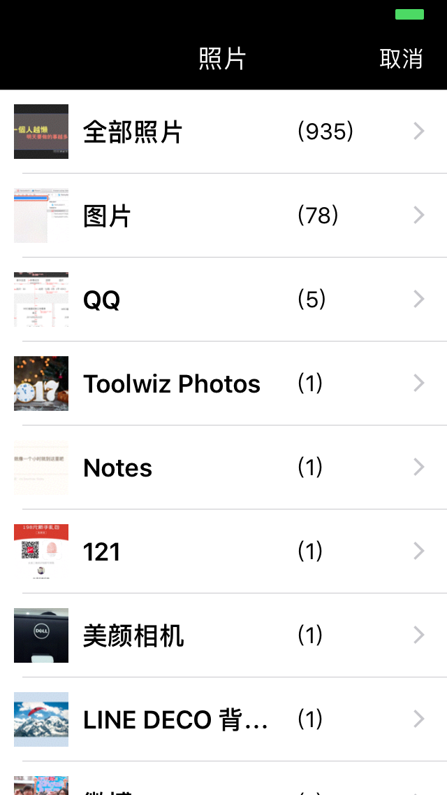

### 使用方法 

1.展示图片

    SYPhotoGroupViewController *vc = [[SYPhotoGroupViewController alloc] init];
    vc.videoEnabled = NO;
    vc.didFinishcompletionBlock = ^(NSArray *items)
    {
    NSLog(@"选择的图片：%@",items);
    };
    UINavigationController *nav = [[UINavigationController alloc] initWithRootViewController:vc];
    [self presentViewController:nav animated:YES completion:nil];

2.展示视频

    SYPhotoGroupViewController *vc = [[SYPhotoGroupViewController alloc] init];
    vc.videoEnabled = YES;
    vc.didFinishcompletionBlock = ^(NSArray *items)
    {
    NSLog(@"选择的视频：%@",items);
    };
    UINavigationController *nav = [[UINavigationController alloc] initWithRootViewController:vc];
    [self presentViewController:nav animated:YES completion:nil];

